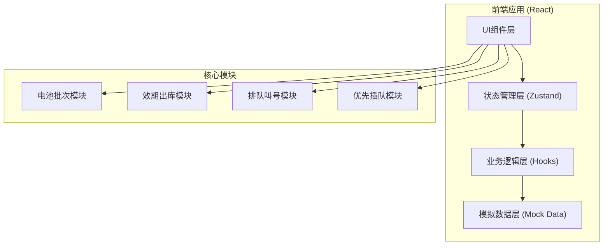
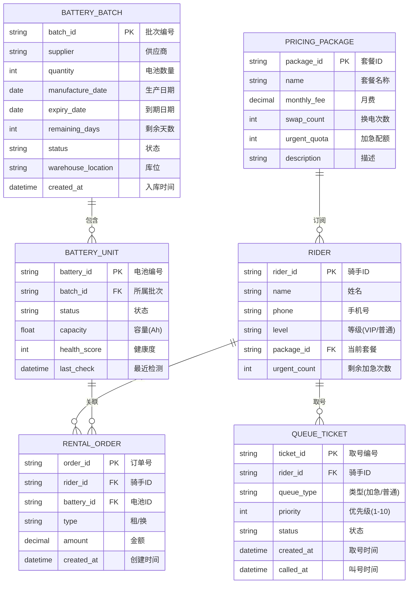

## 1. 架构设计



## 2. 技术选型

- **前端框架**：React@18 + TypeScript@5
- **构建工具**：Vite@5
- **样式方案**：TailwindCSS@3 + CSS变量主题
- **状态管理**：Zustand@4（轻量、简洁）
- **路由方案**：React Router@6
- **UI组件**：Ant Design@5（企业级组件库）
- **图标**：@ant-design/icons + Lucide React
- **图表**：Recharts（仪表盘统计图表）
- **日期处理**：Day.js
- **动画**：Framer Motion

## 3. 路由定义

| 路由路径 | 页面组件 | 功能说明 |
|----------|----------|----------|
| `/dashboard` | DashboardPage | 首页数据概览仪表盘 |
| `/battery/batches` | BatchListPage | 电池批次列表 |
| `/battery/warehouse` | WarehouseInPage | 到货验收入库 |
| `/expiry/outbound` | OutboundPage | 效期先进先出出库 |
| `/expiry/warning` | WarningPage | 临期预警看板 |
| `/queue/ticket` | TicketPage | 骑手取号界面 |
| `/queue/display` | DisplayPage | 叫号大屏展示 |
| `/queue/manage` | QueueManagePage | 优先级队列维护 |
| `/pricing/packages` | PackagePage | 套餐月费管理 |
| `/pricing/bills` | BillPage | 账单统计 |
| `/login` | LoginPage | 登录页面 |

## 4. 数据模型

### 4.1 实体关系图



### 4.2 核心业务规则

1. **FIFO出库规则**：出库时按 expiry_date 升序排序，选择剩余天数最少且未锁定的批次
2. **临期预警阈值**：剩余天数≤30天红色预警，≤90天黄色提醒，≤0天自动锁定
3. **优先级规则**：加急优先级=1（最高），VIP普通=3，普通用户=5，数值越小优先级越高
4. **加急插队**：加急单插入当前所有普通单之前、已有加急单之后
5. **套餐配额**：月套餐超出换电次数后按次计费，加急次数用完需额外付费

## 5. 模块文件结构

```
src/
├── components/           # 通用UI组件
│   ├── layout/          # 布局组件(Sidebar/Header)
│   ├── dashboard/       # 仪表盘组件
│   ├── battery/         # 电池相关组件
│   ├── queue/           # 队列相关组件
│   └── pricing/         # 计价相关组件
├── pages/               # 页面组件
├── store/               # Zustand状态管理
│   ├── batteryStore.ts
│   ├── queueStore.ts
│   └── userStore.ts
├── hooks/               # 自定义Hooks
│   ├── useFIFO.ts       # 先进先出算法
│   ├── usePriorityQueue.ts # 优先级队列
│   └── useExpiryCheck.ts # 效期检查
├── types/               # TypeScript类型定义
├── mock/                # 模拟数据
├── utils/               # 工具函数
│   ├── dateUtils.ts
│   ├── queueUtils.ts
│   └── pricingUtils.ts
├── App.tsx
├── main.tsx
└── index.css
```
