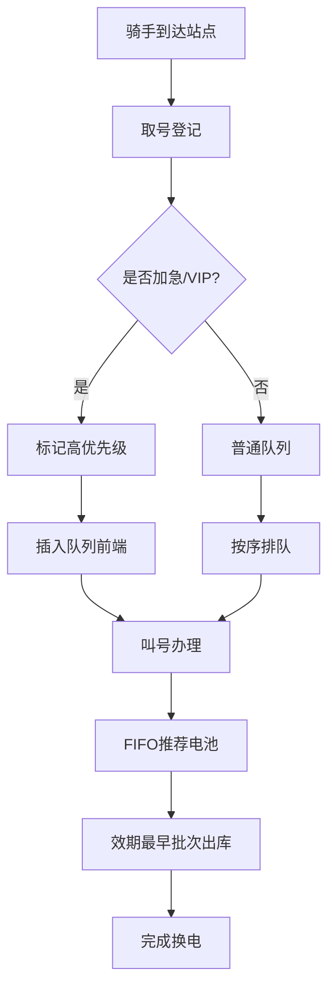

## 1. 产品概述

电动车电池租换管理系统，面向电池租赁运营场景，解决电池批次管理、效期管控、换电排队三大核心痛点。通过先进先出算法确保电池安全流转，优先级队列提升骑手换电效率，套餐计价实现商业化运营。

- 目标用户：换电站运营人员、电池管理员、骑手用户
- 核心价值：降低电池超期风险、提升换电效率、规范租赁运营

## 2. 核心功能

### 2.1 用户角色

| 角色 | 登录方式 | 核心权限 |
|------|----------|----------|
| 运营管理员 | 账号密码登录 | 全部功能：批次管理、效期审核、叫号调度、套餐配置 |
| 站点操作员 | 账号密码登录 | 入库登记、出库操作、叫号办理、插队处理 |
| 骑手用户 | 手机号登录 | 取号排队、查看队列、套餐查询、加急申请 |

### 2.2 功能模块

1. **电池批次管理模块**：到货验收、批号效期登记、批次状态追踪
2. **效期出库模块**：效期先进先出(FIFO)、临期预警、超期批次锁定
3. **排队叫号模块**：取号排队、叫号办理、队列实时显示
4. **优先插队模块**：优先级队列维护、加急插队、骑手优先级管理

### 2.3 页面详情

| 页面名称 | 模块名称 | 功能描述 |
|----------|----------|----------|
| 首页仪表盘 | 数据概览 | 电池总数、在库数量、临期预警、排队人数、今日换电量统计卡片 |
| 批次管理 | 批次列表 | 批次编号、供应商、入库日期、效期、状态筛选、分页表格 |
| 批次管理 | 到货验收入库 | 批号输入、供应商选择、数量录入、效期登记、质检确认表单 |
| 效期出库 | 出库调度 | FIFO自动推荐、效期排序展示、扫码出库确认 |
| 效期出库 | 临期预警看板 | 30天内临期红色预警、90天内黄色提醒、超期锁定批次列表 |
| 排队叫号 | 取号界面 | 骑手信息录入、套餐选择、取号按钮、号码牌生成 |
| 排队叫号 | 叫号大屏 | 当前叫号、等待队列、预计等待时间、叫号动画效果 |
| 优先级插队 | 队列管理 | 优先级标识(加急/普通/VIP)、手动调整顺序、一键插队操作 |
| 套餐计价 | 套餐管理 | 月费套餐配置、按次计费、押金管理、骑手账单统计 |

## 3. 核心流程

### 电池入库流程
运营人员接收新电池 → 录入批号和效期 → 系统自动计算剩余天数 → 质检通过入库 → 批次状态更新为"在库"

### 出库FIFO流程
骑手申请换电 → 系统按效期升序筛选在库电池 → 推荐最早到期批次 → 确认出库 → 状态更新为"在租"

### 排队叫号流程
骑手到达站点 → 扫码/手动取号 → 系统分配队列优先级 → 进入等待队列 → 操作员叫号 → 办理换电

### 优先级插队流程
骑手提交加急申请 → 审核通过(或VIP自动识别) → 队列插入高优先级位置 → 优先叫号办理

## 4. 用户界面设计

### 4.1 设计风格
- **主色调**：深青色(#0E7490) + 警示红(#DC2626) + 活力橙(#F97316)
- **辅助色**：成功绿(#16A34A)、警告黄(#EAB308)、信息蓝(#2563EB)
- **按钮风格**：圆角胶囊形、渐变填充、hover有位移阴影
- **字体**：标题用Noto Sans SC Bold，正文用Noto Sans SC Regular
- **布局**：左侧导航栏 + 顶部状态栏 + 右侧卡片式内容区
- **图标风格**：线性描边图标，统一2px线宽

### 4.2 页面设计概览

| 页面名称 | 模块名称 | UI元素 |
|----------|----------|--------|
| 仪表盘 | 数据概览 | 渐变统计卡片、迷你趋势图、环形进度条(电池健康度)、警告横幅 |
| 批次管理 | 入库表单 | 分步向导、日期选择器、自动批号生成、二维码预览 |
| 效期出库 | 预警看板 | 三色预警卡片、倒计时标签、锁定徽章、批次详情抽屉 |
| 叫号大屏 | 队列展示 | 大号数字叫号牌、跑马灯队列、闪烁动画、声音提示开关 |
| 插队管理 | 优先级队列 | 拖拽排序、优先级色块、插队确认弹窗、操作日志时间线 |

### 4.3 响应式
- 桌面端优先设计(1920x1080基准)
- 叫号大屏支持全屏模式，适配竖屏显示器
- 骑手取号页适配手机端触屏操作

### 4.4 动效设计
- 叫号时数字翻转动画 + 提示音
- 预警卡片呼吸闪烁效果
- 队列更新时滑动过渡动画
- 按钮点击涟漪反馈
- 页面加载元素渐入组合
